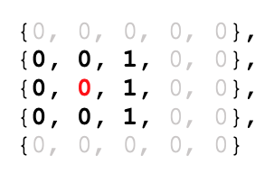

## TASK 1. EXCEPTIONS HANDLING

**Source Data**<br>
The source data is a matrix of an arbitrary size that contains the values 1 and 0. Each cell of the matrix has a certain number of neighbors. The neighbors of the cell are everything cells around it. Thus, a cell can have a maximum of 8 neighbors. The following matrix is a source data for this task:
```
short[][] matrix = {
	{0, 0, 0, 0, 0},
	{0, 0, 1, 0, 0},
	{0, 0, 1, 0, 0},
	{0, 0, 1, 0, 0},
	{0, 0, 0, 0, 0}
};
```

**Task Requirements**<br>
It’s a necessity to create a class that will get a source matrix as input data. This class should have a matrix processing method that returns an output matrix. Each element of the output matrix must contain the number of neighbors with value equals 1 for the cell with the same index from the source matrix.
For instance, the number of neighbors with value equals 1 for the cell with coordinates {2, 3} is 3. This cell is highlighted in red color, and all its neighbors are highlighted as bold.



There is the following important condition: you must use the exceptions handling as part of the solution.
